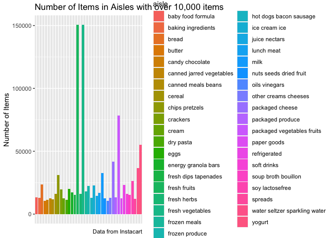

p8105\_hw3\_ml4424
================
Maggie Li (ml4424)
10/9/2020

## Problem 1

``` r
library(p8105.datasets)
library(tidyverse)
```

    ## ── Attaching packages ───────────────────────────────────────────────────────────────────────────── tidyverse 1.3.0 ──

    ## ✓ ggplot2 3.3.2     ✓ purrr   0.3.4
    ## ✓ tibble  3.0.3     ✓ dplyr   1.0.2
    ## ✓ tidyr   1.1.2     ✓ stringr 1.4.0
    ## ✓ readr   1.4.0     ✓ forcats 0.5.0

    ## ── Conflicts ──────────────────────────────────────────────────────────────────────────────── tidyverse_conflicts() ──
    ## x dplyr::filter() masks stats::filter()
    ## x dplyr::lag()    masks stats::lag()

``` r
library(utils)
library(ggplot2)
library(patchwork)
library(ggridges)


data("instacart")
# View(instacart)
head(instacart)
```

    ## # A tibble: 6 x 15
    ##   order_id product_id add_to_cart_ord… reordered user_id eval_set order_number
    ##      <int>      <int>            <int>     <int>   <int> <chr>           <int>
    ## 1        1      49302                1         1  112108 train               4
    ## 2        1      11109                2         1  112108 train               4
    ## 3        1      10246                3         0  112108 train               4
    ## 4        1      49683                4         0  112108 train               4
    ## 5        1      43633                5         1  112108 train               4
    ## 6        1      13176                6         0  112108 train               4
    ## # … with 8 more variables: order_dow <int>, order_hour_of_day <int>,
    ## #   days_since_prior_order <int>, product_name <chr>, aisle_id <int>,
    ## #   department_id <int>, aisle <chr>, department <chr>

``` r
## more descriptives for illustrative examples
length(unique(instacart$product_id))
```

    ## [1] 39123

``` r
length(unique(instacart$user_id))
```

    ## [1] 131209

``` r
length(unique(instacart$department))
```

    ## [1] 21

**Description**: This dataset contains 1,384,617 observations that
represent a unique product from an Instacart order in 2017. These data
appear nested: these are products within orders within customers. There
are 15 total variables; key variables include identifying the order that
product came from, identifying the product, the order in which the item
was added to the cart, if the product was a reorder, identifying the
customer, order sequence number of the specific user, the day of week
the order was placed, the hour of week the order was placed, the days
that have passed since the last order by the customer, the name of the
product, identifying the aisle and department of the product and the
names of the aisle and department.

There are 131,209 users ordering 39,123 unique products from 21 unique
departments such as dairy, canned goods, produce, bulk, bakery,
household, etc.

``` r
## How many aisles are there?
length(unique(instacart$aisle_id))
```

    ## [1] 134

``` r
## which aisles are the most items ordered from?
instacart %>% 
  count(aisle, name = "n_obs") %>% 
  arrange(desc(n_obs))
```

    ## # A tibble: 134 x 2
    ##    aisle                          n_obs
    ##    <chr>                          <int>
    ##  1 fresh vegetables              150609
    ##  2 fresh fruits                  150473
    ##  3 packaged vegetables fruits     78493
    ##  4 yogurt                         55240
    ##  5 packaged cheese                41699
    ##  6 water seltzer sparkling water  36617
    ##  7 milk                           32644
    ##  8 chips pretzels                 31269
    ##  9 soy lactosefree                26240
    ## 10 bread                          23635
    ## # … with 124 more rows

There are 134 unique aisles. The fresh vegetable aisle has the most
items ordered from it.

``` r
## Make a plot that shows the number of items ordered in each aisle, limiting this to aisles with more than 10000 items ordered. Arrange aisles sensibly, and organize your plot so others can read it.

## aisles with more than 10,000 items. there are 39 unique aisles
select_aisles <- instacart %>% 
  count(aisle, name = "n_obs") %>% 
  filter(n_obs > 10000)

unique(select_aisles$aisle)
```

    ##  [1] "baby food formula"             "baking ingredients"           
    ##  [3] "bread"                         "butter"                       
    ##  [5] "candy chocolate"               "canned jarred vegetables"     
    ##  [7] "canned meals beans"            "cereal"                       
    ##  [9] "chips pretzels"                "crackers"                     
    ## [11] "cream"                         "dry pasta"                    
    ## [13] "eggs"                          "energy granola bars"          
    ## [15] "fresh dips tapenades"          "fresh fruits"                 
    ## [17] "fresh herbs"                   "fresh vegetables"             
    ## [19] "frozen meals"                  "frozen produce"               
    ## [21] "hot dogs bacon sausage"        "ice cream ice"                
    ## [23] "juice nectars"                 "lunch meat"                   
    ## [25] "milk"                          "nuts seeds dried fruit"       
    ## [27] "oils vinegars"                 "other creams cheeses"         
    ## [29] "packaged cheese"               "packaged produce"             
    ## [31] "packaged vegetables fruits"    "paper goods"                  
    ## [33] "refrigerated"                  "soft drinks"                  
    ## [35] "soup broth bouillon"           "soy lactosefree"              
    ## [37] "spreads"                       "water seltzer sparkling water"
    ## [39] "yogurt"

``` r
## plot select aisles
aisles_plot <- ggplot(select_aisles, 
                      aes(x=aisle, y = n_obs, fill = aisle)) +
  geom_bar(stat="identity") +
  theme(axis.title.x=element_blank(),
        axis.text.x=element_blank(),
        axis.ticks.x=element_blank()) +
  labs(
    title = "Number of Items in Aisles with over 10,000 items",
    y = "Number of Items",
    caption = "Data from Instacart")

aisles_plot
```

<!-- -->

## Problem 2

``` r
accel <- read_csv("prob2_data/accel_data.csv") %>% 
  janitor::clean_names() %>% 
  drop_na() %>% 
  pivot_longer(cols = starts_with("activity"),
               names_to = "minute_of_day",
               values_to = "activity_ct") # note: convert wide to long, so each row is a minute of day
```

    ## 
    ## ── Column specification ──────────────────────────────────────────────────────────────────────────────────────────────
    ## cols(
    ##   .default = col_double(),
    ##   day = col_character()
    ## )
    ## ℹ Use `spec()` for the full column specifications.

``` r
accel
```

    ## # A tibble: 50,400 x 5
    ##     week day_id day    minute_of_day activity_ct
    ##    <dbl>  <dbl> <chr>  <chr>               <dbl>
    ##  1     1      1 Friday activity_1           88.4
    ##  2     1      1 Friday activity_2           82.2
    ##  3     1      1 Friday activity_3           64.4
    ##  4     1      1 Friday activity_4           70.0
    ##  5     1      1 Friday activity_5           75.0
    ##  6     1      1 Friday activity_6           66.3
    ##  7     1      1 Friday activity_7           53.8
    ##  8     1      1 Friday activity_8           47.8
    ##  9     1      1 Friday activity_9           55.5
    ## 10     1      1 Friday activity_10          43.0
    ## # … with 50,390 more rows

``` r
## Part 1 add weekday vs weekend variable
accel <- accel %>% 
  mutate(weekday = ifelse(day %in% c('Monday','Tuesday',
                                     'Wednesday', 'Thursday',
                                     'Friday'),
                          "yes", "no"))

length(unique(accel$minute_of_day))
```

    ## [1] 1440

**Description**: The dataset contains a variable for week number (1-5),
day\_id and day to indicate day of week, minute of the day (1-1440), the
activity counts for each minute, and whether the activity count was
recorded on a weekday or not. There are 50,400 data entries (7 days/week
\* 5 weeks \* 1440 minutes/day).

``` r
## aggregate across minutes to create total activity count per day
daily_accel <- accel %>% 
  group_by(day_id) %>% 
  summarize(daily_ct = sum(activity_ct))
```

    ## `summarise()` ungrouping output (override with `.groups` argument)

``` r
daily_accel
```

    ## # A tibble: 35 x 2
    ##    day_id daily_ct
    ##     <dbl>    <dbl>
    ##  1      1  480543.
    ##  2      2   78828.
    ##  3      3  376254 
    ##  4      4  631105 
    ##  5      5  355924.
    ##  6      6  307094.
    ##  7      7  340115.
    ##  8      8  568839 
    ##  9      9  295431 
    ## 10     10  607175 
    ## # … with 25 more rows

**Trends**: There appears to be

## Problem 3

``` r
ny_noaa <- data("ny_noaa")
ny_noaa
```

    ## [1] "ny_noaa"
